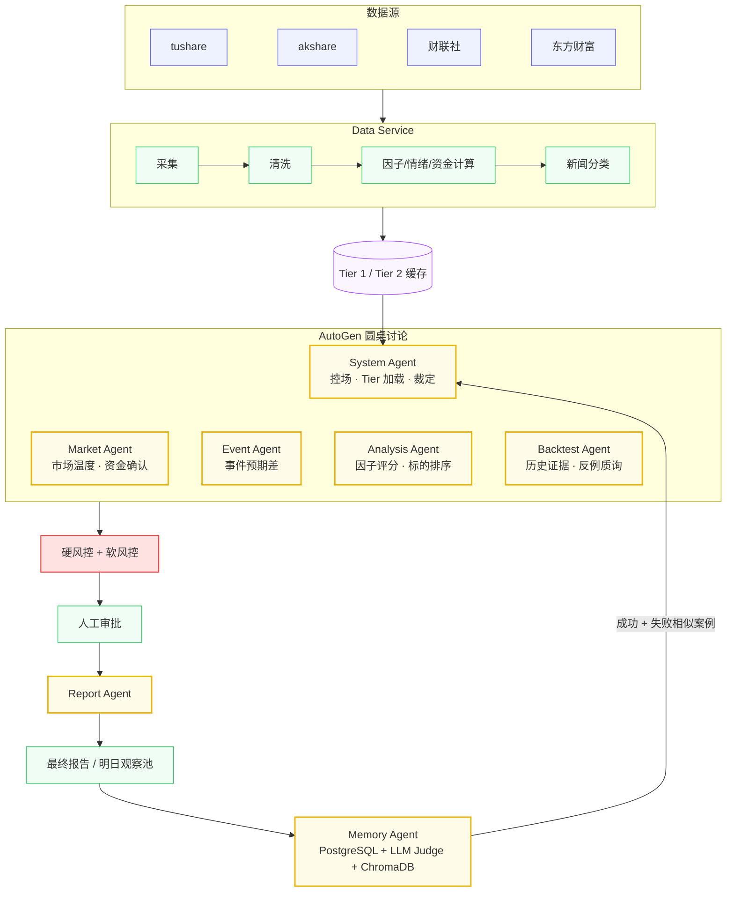

# 多智能体量化交易分析系统 — 方案设计

## 目录

- [一、核心定位](#section-positioning)
- [二、系统架构](#section-architecture)
- [三、用户问题如何启动](#section-user-story)
- [四、Agent 设计](#section-agents)
- [五、目标函数与 Alpha](#section-alpha)
- [六、数据点位与 Schema](#section-data-schema)
- [七、回测包设计](#section-backtest-package)
- [八、讨论与决策机制](#section-discussion)
- [九、风控体系](#section-risk)
- [十、Memory 与复盘](#section-memory)
- [十一、技术选型与成本](#section-tech)

---

<a id="section-positioning"></a>
## 一、核心定位

本系统是一个面向 A 股中短线投研的研究型方案，最终形态可以是开源项目，也可以继续发展成内部工具或产品化系统，具体定位后续再根据老师意见确定。当前设计先聚焦方案本身：用一组 AI Agent 模拟投研团队协作，数据先由确定性流程加工，Agent 只在需要解释、质询、裁定的环节介入，最后经硬风控与人工审批后输出可回测、可复盘、可对比的“明日观察池”。

**第一版目标：盘后生成明日观察池。**

系统默认在每个交易日收盘后运行，使用当日收盘后已经可得的数据，生成下一交易日可关注的板块、标的、理由、风险、仓位建议、失效条件和复盘字段。第一版不是最小 MVP，而是功能完整的方案版本；但它不直接假设盘中实时交易，也不承诺自动执行。

**核心交付：**
- 明日观察池：recommend / watch / reject 三类结果。
- 每个结果绑定 Alpha 来源、目标持有周期、失效条件和复盘指标。
- 每次运行保留数据快照、Prompt、模型版本、Agent 发言、风控结果和人工审批记录。
- 提供回测与对比脚本，方便和参考项目、单 Agent 版本、无 Agent 基线做横向比较。

**底线原则：**

| 原则 | 含义 |
|---|---|
| 定位待定 | 当前先做可复现、可审计、可对比的完整方案，后续再决定开源或上线 |
| 盘后观察池优先 | 第一版默认盘后运行，输出明日观察池，不默认盘中自动交易 |
| LLM 不直接管风控 | 硬风控全部由代码执行 |
| 数据处理可复现 | 采集、清洗、因子计算、缓存写入均确定性执行 |
| Agent 有边界 | 每个 Agent 只对自己职责内结论负责 |
| 推荐可证伪 | 每个买入建议必须绑定 Alpha 来源、失效条件和复盘指标 |
| 人工审批在前 | 未审批不执行，审批动作必须记录 |
| 可回放 | 每次运行的数据、Prompt、模型、讨论、风控、审批、绩效都可追溯 |

---

<a id="section-architecture"></a>
## 二、系统架构



**运行链路：**

```text
数据采集 → 数据质量校验 → Tier 缓存
→ Memory 召回成功/失败案例
→ System Agent 分配上下文
→ Market/Event/Analysis/Backtest 圆桌讨论
→ Backtest 样本强度校验
→ System Agent 裁定
→ 硬风控 + 软风控
→ 人工审批
→ 报告 / 明日观察池
→ 绩效追踪
→ Memory 写入复盘经验
```

---

<a id="section-user-story"></a>
## 三、用户问题如何启动

假设用户在收盘后问：

```text
今天新能源车板块能不能做？有没有值得关注的标的？
```

系统不会直接让某一个 Agent 给出“能”或“不能”的主观回答，而是把这个问题转成一次“明日观察池”生成任务。System Agent 先判断：这是一个“板块 + 交易机会”问题，需要回答新能源车板块明天是否值得关注、有没有明确 Alpha 来源、是否需要深入到个股层面，以及最终应该给出推荐、观察还是拒绝。

System Agent 首先要求 Data Service 提供 Tier 1 数据包。这个数据包不包含所有细节，只包含足够做第一轮判断的市场摘要：大盘状态、市场情绪、新能源车相关板块排名、资金状态、风险状态等。如果缓存过期，Data Service 会重新采集行情、资金流和新闻，完成清洗、去重、事件分类和风险状态检查，再写入 Tier 1 和必要的 Tier 2 缓存。

随后 Memory Agent 会把“新能源车 + 当前市场情绪 + 资金状态 + 可能的政策/事件催化”编码成今日情境，召回历史上相似的成功案例和失败案例。比如，历史上政策催化后 5 日上涨的样本会被列出来；同时，利好兑现、冲高回落、资金没有跟随的失败样本也会被列出来。这样做的目的是防止系统只记住成功故事，而忘记类似场景下为什么会失败。

第一轮讨论从 Market Agent 开始。Market Agent 先回答“现在能不能进攻”：如果市场情绪冰点，它会建议低仓位或观察；如果情绪正常且新能源车资金连续流入，它会允许继续讨论；如果板块上涨但资金净流出，它会提示资金背离。它不直接推荐个股，只判断市场环境和板块资金是否支持进一步分析。

接着 Event Agent 查看 event_schema，判断近期是否存在政策、订单、业绩或产业链事件。如果发现新能源汽车补贴政策超预期，它不会只写“政策利好”，而要说明事件主体、定价机制、传导路径、半衰期、证据等级和失效条件。如果事件只是在概念上相关、没有明确公司映射或收入暴露，它只能建议观察，不能直接把概念股放进推荐池。

Analysis Agent 再把事件热度拉回因子框架。它先用 Tier 1 判断新能源车板块的强度、动量、流动性和估值状态；如果需要进入个股层面，System Agent 再加载 Tier 2 的个股因子明细。Analysis Agent 会把质量、成长、估值、动量、波动率、流动性放在一起比较，把高热度但因子很差、估值拥挤、流动性不足或动量衰竭的标的降级。

Backtest Agent 最后做历史证据审查。它根据“情绪正常 + 政策催化 + 新能源车 + 资金确认”去找相似历史样本，回答样本数够不够、5 日和 10 日表现如何、平均超额收益是否显著、失败案例通常发生在什么条件下，以及当前情况更像成功样本还是失败样本。如果样本数不足，或者收益主要来自不可成交涨停，它必须降低置信度。

如果四个 Agent 之间出现矛盾，System Agent 会进入第二轮交叉质询。比如 Backtest Agent 可能质询 Event Agent：“你说半衰期是 10 日，但历史收益集中在前 3 日，是否高估？”Market Agent 可能质询 Analysis Agent：“候选标的因子不错，但板块资金已经放缓，是否应该降低仓位？”Analysis Agent 也可以质询 Event Agent：“这个受益链到底是直接收入暴露，还是只是概念映射？”System Agent 只保留影响决策的矛盾，终止无效争论。

最后，System Agent 汇总讨论、Memory、回测和风控结果，输出三类结论之一：

```text
推荐：Alpha 清晰、资金确认、因子支持、回测样本有效、风控通过。
观察：Alpha 存在但样本不足、资金背离、估值过高或事件链条偏弱。
拒绝：硬风控不通过、Alpha 不清晰、历史反例强、交易成本过高。
```

裁定完成后，硬风控会检查是否 ST、停牌、退市风险、一字板、跌停不可成交、日成交额不足、冲击成本过高、单票或单板块仓位超限。通过后进入人工审批。人工可以通过、拒绝、降仓、加入观察池，或者要求补充数据重跑。Report Agent 最后只负责把裁定结果写成报告，不新增投资观点。

这个流程结束后，系统不会立刻认定自己正确。它会在 1/3/5/10 个交易日后持续复盘：观察池是否跑赢基准，是否触发失效条件，推荐、观察、拒绝三类结果是否真的有区分度，人工审批到底是提高了结果质量，还是拖累了系统表现。这些复盘结果再写回 Memory，供下一次相似问题调用。

---

<a id="section-agents"></a>
## 四、Agent 设计

**本节小目录：**

- [4.1 Data Service 设计](#agent-data-service)
- [4.2 Memory Agent 设计](#agent-memory)
- [4.3 System Agent 设计](#agent-system)
- [4.4 Market Agent 设计](#agent-market)
- [4.5 Event Agent 设计](#agent-event)
- [4.6 Analysis Agent 设计](#agent-analysis)
- [4.7 Backtest Agent 设计](#agent-backtest)
- [4.8 Report Agent 设计](#agent-report)

| 角色 | 定位 | 核心输出 | 边界 |
|---|---|---|---|
| Data Service | 数据底座，不参与讨论 | Tier 1 / Tier 2 Schema | 不产生投资观点 |
| Memory Agent | 经验库与复盘层 | 成功/失败相似案例、Agent 评分 | 不参与交易裁定 |
| System Agent | 组长与裁判 | Tier 加载、讨论控场、最终裁定 | 不绕过硬风控 |
| Market Agent | 市场状态分析师 | 市场温度、仓位环境、资金确认 | 不直接给个股买入结论 |
| Event Agent | 事件分析师 | 事件方向、传导路径、半衰期、受益链 | 不输出无验证链条的标的 |
| Analysis Agent | 量化分析师 | 因子评分、板块/个股排序、择时过滤 | 不判断新闻真实性 |
| Backtest Agent | 历史证据审查员 | 胜率、收益、样本量、反例、持仓周期 | 不创造新叙事 |
| Report Agent | 报告输出层 | 推荐理由、风控结果、审批记录、复盘字段 | 不新增投资观点 |

<a id="agent-data-service"></a>
### 4.1 Data Service 设计

Data Service 是系统的数据底座，严格意义上不是 Agent，而是一条确定性数据工作流。它负责把行情、资金、板块、新闻、风险状态等原始数据加工成统一 Schema，让后续 Agent 不直接面对脏数据、重复新闻、时间错位或口径不一致的问题。盘后观察池场景下，Data Service 必须只使用当日收盘后已经发布、已经落库、带时间戳的数据。

**职责：**
- 采集多源行情、资金流、板块、新闻和风控状态。
- 对数据做缺失值、异常值、停牌、ST、新股、复权、时间对齐处理。
- 计算情绪指标、资金指标、板块强度、个股因子。
- 把新闻从非结构化文本转成结构化事件候选。
- 写入 Tier 1 / Tier 2 缓存，并记录数据版本。
- 为每个字段记录 as_of_date、available_at、source、vendor_version，防止回测读取未来数据。

**输入：**
- tushare、akshare 行情和资金流。
- 财联社、东方财富等新闻源。
- 交易所状态、停牌、ST、涨跌停、黑名单等风险数据。

**处理逻辑：**

```text
行情采集（主备源 + 重试）
→ 新闻去重（TF-IDF + 相似度）
→ 新闻分级（来源权重 + 时效性）
→ LLM 批量分类（类型/置信度/实体）
→ 数据清洗（缺失/异常/ST/停牌/复权/时间对齐）
→ 因子、情绪、资金、板块强度计算
→ 写入 Tier 1 / Tier 2 缓存
```

**Tier 1 和 Tier 2 是什么：**

Tier 可以理解为“给 Agent 的数据包分层”。因为 LLM 不能一次塞入所有行情、新闻、个股因子和回测明细，所以 Data Service 先把数据整理成两层缓存。

| 层级 | 含义 | 典型内容 | 使用方式 |
|---|---|---|---|
| Tier 1 | 每次讨论默认加载的轻量摘要 | 大盘状态、情绪指标、板块 Top 10、资金概览、风险状态 | 支撑 Round 1，让 Agent 先判断今天大方向和重点板块 |
| Tier 2 | 需要时再加载的详细数据 | 指定板块个股因子、具体新闻事件、相似回测样本、个股风险明细 | 支撑 Round 2 或具体标的分析，避免一开始塞太多噪音 |

举例来说，用户问“今天新能源车板块能不能做”，系统会先加载 Tier 1，看市场情绪、板块排名、资金状态和风险状态。如果新能源车确实进入讨论范围，System Agent 再加载新能源车相关的 Tier 2，包括该板块个股因子明细、近期事件列表和相似历史回测样本。

**输出：**
- market_schema、sentiment_schema、capital_schema、sector_schema。
- factor_schema、event_schema、risk_schema。
- 数据质量报告：缺失率、异常数、数据源失败次数、缓存版本。
- point_in_time_manifest：记录本次运行允许使用的数据边界。

**设计重点：**
- LLM 只用于新闻批量分类，不参与行情清洗和因子计算。
- 所有数值型指标必须可复算、可追溯。
- 若关键数据缺失，系统降级为“只输出数据报告，不给交易建议”。
- 回测和实盘研究必须走同一套字段定义，不能为回测单独补充未来才知道的信息。

<a id="agent-memory"></a>
### 4.2 Memory Agent 设计

Memory Agent 是系统的经验库和复盘层，不参与实时交易裁定。它解决的问题是：系统不能每天都像第一次交易一样重新开始，必须知道过去在类似情境下哪些判断有效、哪些判断失败、哪些 Agent 经常误判。

**职责：**
- 保存完整运行记录：原始数据、Agent 发言、裁定、审批、执行和绩效。
- 把高价值经验压缩成向量检索记录。
- 每天为 System Agent 提供相似成功案例和相似失败案例。
- 统计各 Agent 的历史准确率、误判类型和贡献度。
- 识别冲突记忆，交给人工裁定。

**输入：**
- 当日市场情境向量。
- 历史推荐、执行、收益、回撤、失败原因。
- Agent 每轮发言和最终裁定。

**处理逻辑：**
- PostgreSQL 保存完整记录，用于审计和回放。
- LLM Judge 判断新记录是 novel / redundant / conflicting。
- ChromaDB 保存精简检索版，用于相似情境召回。
- 记忆记录加入 market regime、时间衰减、样本质量权重。

**输出：**
- top-N 相似成功案例。
- top-N 相似失败案例。
- Agent 评分摘要。
- 历史误判提醒，例如“政策催化类事件常被高估半衰期”。

**设计重点：**
- 不只记成功样本，失败样本必须优先提醒。
- 旧样本要衰减，不同市场 regime 不能无脑迁移。
- 系统原始建议绩效和人工最终执行绩效必须分开记录。

<a id="agent-system"></a>
### 4.3 System Agent 设计

System Agent 是组长和裁判，负责把用户问题转成一次完整工作流。第一版默认将问题转成“盘后生成明日观察池”的任务。它不应该自己承担所有分析，而是控制谁发言、读哪些数据、什么时候追加上下文、什么时候停止讨论，以及最终是否推荐、观察或拒绝。

**职责：**
- 解析用户意图：问大盘、问板块、问个股、问事件，还是问是否交易。
- 将交易问题统一落到盘后观察池输出：明日关注、建议观察、拒绝参与。
- 指定 Tier 加载范围，控制 token 和上下文规模。
- 调度 Market、Event、Analysis、Backtest 依次发言。
- 拦截越权发言和无数据支撑的观点。
- 汇总争议点，推动 Round 2 质询。
- 执行软风控，输出推荐、观察或拒绝。

**输入：**
- 用户问题。
- Tier 1 / Tier 2 数据。
- Memory 成功/失败案例。
- 各 Agent 的讨论结果。
- risk_schema 的硬风控结果。

**处理逻辑：**
- 先加载 Tier 1，形成市场和板块级判断。
- 若问题涉及具体板块、事件或个股，再加载 Tier 2。
- 讨论中发现矛盾时，要求指定 Agent 回答。
- 如果 Backtest 样本不足、Alpha 不清晰或风控不通过，降级为观察或拒绝。

**输出：**
- decision：recommend / watch / reject。
- position：建议仓位。
- alpha_source：事件预期差 / 资金确认 / 因子过滤 / 多 Agent 质询。
- horizon：默认 1/3/5/10 个交易日复盘，其中主目标为 5 日超额收益。
- reasons：支持理由。
- objections：反对意见。
- invalid_conditions：失效条件。
- risk_result：HARD_VETO / SOFT_VETO / PASS。

**设计重点：**
- 它是控场者，不是“最聪明的分析师”。
- 不允许绕过硬风控。
- 不允许输出没有 Alpha 来源的推荐。

<a id="agent-market"></a>
### 4.4 Market Agent 设计

Market Agent 负责回答“现在能不能进攻”。它不直接选股，而是判断市场温度、资金流向、板块是否被真实资金确认，以及当前环境对仓位有多友好。

**职责：**
- 判断市场情绪：冰点、正常、高潮。
- 计算仓位上限。
- 判断板块资金流入是否持续。
- 检测价格上涨与资金流出的背离。
- 给 Event 和 Analysis 的结论提供市场环境校准。

**输入：**
- sentiment_schema：涨跌比、涨停数、炸板率、情绪分数、媒体比。
- capital_schema：板块成交额、主力净流入、连续净流入天数。
- sector_schema：板块强度和排名。

**处理逻辑：**
- 用确定性规则先给出情绪档位。
- 根据情绪档位映射总仓位上限。
- 检查目标板块是否量价齐升。
- 若热点上涨但资金不跟随，输出背离警告。

**输出：**
- market_state：冰点 / 正常 / 高潮。
- position_cap：组合仓位上限。
- capital_confirmation：资金确认 / 资金背离 / 资金不足。
- sector_preference：当前更适合进攻的板块。

**设计重点：**
- 市场高潮不等于重仓，可能反而要降仓。
- 它只判断环境和资金，不直接决定买哪只股票。

<a id="agent-event"></a>
### 4.5 Event Agent 设计

Event Agent 负责回答“这条新闻有没有交易价值”。它不是复述新闻，而是判断事件是否形成预期差、影响链条是否成立、半衰期多长、哪些板块或标的是直接受益。

**职责：**
- 识别事件类型：政策、订单、业绩、合规、情绪、供给冲击。
- 判断方向：利好、利空、中性。
- 识别传导路径：事件如何影响业绩、估值或资金行为。
- 判断兑现程度：是否已经被市场交易过。
- 给出半衰期和失效条件。
- 识别伪链条：只要缺少实体映射、收入暴露、直接受益证据或市场未定价证据，就不得推荐，只能观察。

**输入：**
- event_schema：事件摘要、实体、类型、置信度、发布时间。
- Memory 中相似事件的成功和失败案例。
- Backtest Agent 后续返回的历史验证。

**处理逻辑：**
- 先判断事件是否与上市公司或板块有明确实体映射。
- 再判断传导路径是否足够直接。
- 估算影响方向、半衰期和置信度。
- 如果链条过长或证据不足，只进入观察池。

**反伪链条规则：**
- 实体映射：事件主体必须能映射到上市公司、板块或明确产业链环节；只出现泛概念词不算映射。
- 收入暴露：如果推荐个股，必须说明该公司与事件相关业务的收入、订单、产能、客户或公告依据；没有依据则只能给板块观察。
- 传导长度：事件 → 业绩/估值/资金 的链条超过 3 跳，默认降级为观察。
- 已定价检查：若事件发布前后标的已经连续大涨、成交额异常放大或涨停不可买，必须标记“可能已定价”。
- 证据等级：公告/交易所/公司披露 > 权威媒体 > 行业媒体 > 社交传闻；低等级来源不得单独支撑推荐。
- 反例提醒：Memory 或 Backtest 中同类伪链条失败案例必须展示给 System Agent。

**输出：**
- pricing_mechanism：定价机制。
- direction：positive / negative / neutral。
- confidence：置信度。
- transmission_path：传导路径。
- direct_beneficiaries：直接受益板块或标的。
- half_life_days：半衰期。
- invalid_conditions：证伪条件。
- evidence_level：证据等级。
- pricing_status：未定价 / 部分定价 / 疑似过度定价。
- chain_quality：direct / indirect / weak，其中 weak 只能进入观察池。

**设计重点：**
- 不能凭“看起来相关”推荐标的。
- 必须明确事件主体、传导路径、受益对象和证伪条件。
- 没有可验证链条的事件，不得进入推荐池。
- LLM 可以解释事件，但不能替代实体映射、收入暴露和已定价检查。

<a id="agent-analysis"></a>
### 4.6 Analysis Agent 设计

Analysis Agent 是传统量化投研角色，负责把事件热度和市场情绪拉回因子框架。它回答的问题是：这个板块或个股是否真的具备可比较的量化优势，还是只是短期情绪炒作。

**职责：**
- 对板块进行六因子平均评分。
- 对指定板块内个股进行排序。
- 识别估值拥挤、流动性不足、动量衰竭等风险。
- 给推荐标的设置择时过滤条件。
- 跟踪因子有效性衰减。

**输入：**
- sector_schema：板块排名、六因子均分。
- factor_schema：个股质量、成长、估值、动量、波动率、流动性。
- market_schema：行情和成交状态。

**处理逻辑：**
- Round 1 使用 Tier 1 做板块级比较。
- Round 2 按需加载 Tier 2 做个股排序。
- 将高热度但因子差的标的降级。
- 对低流动性、高估值、动量衰竭的标的提示风险。

**输出：**
- sector_score：板块因子评分。
- stock_ranking：个股排序。
- factor_explanation：主要驱动因子。
- timing_filter：买入需要满足的择时条件。
- factor_warning：因子失效或拥挤提醒。

**设计重点：**
- 因子必须经过 IC、ICIR、分层回测和滚动胜率检验。
- 不允许把热点直接等同于买入信号。

<a id="agent-backtest"></a>
### 4.7 Backtest Agent 设计

Backtest Agent 是圆桌里的证据审查员。它负责判断其他 Agent 的观点是否经得起历史验证，同时主动提醒样本不足、选择性回测、市场 regime 不匹配和半衰期外推问题。

**职责：**
- 根据其他 Agent 发言提取板块、事件类型、市场情绪、资金状态。
- 查询相似历史情境。
- 输出胜率、平均收益、超额收益、Sharpe、最大回撤。
- 给出最佳持仓周期和半衰期验证。
- 同时列出成功样本和失败样本。

**输入：**
- event_schema、factor_schema、market_schema。
- 历史回测库。
- Memory 中的相似案例。

**处理逻辑：**
- 先判断样本量是否足够。
- 再判断收益是否显著优于基准。
- 检查样本是否集中在某一特殊行情。
- 如果样本不足或外推风险高，输出 warning。

**输出：**
- sample_size：样本数。
- win_rate：胜率。
- avg_excess_return：平均超额收益。
- holding_period：最佳持仓周期。
- failure_cases：失败案例数量和共性。
- confidence：high / medium / low。

**设计重点：**
- 样本数 < 30 时，不能单独支撑买入。
- 必须同时呈现反例。
- 回测必须扣除滑点、冲击成本和 A 股交易约束。

<a id="agent-report"></a>
### 4.8 Report Agent 设计

Report Agent 是最终交付层，只负责表达，不负责新增判断。它把 System Agent 的结构化裁定转成可读报告，并保证日后能复盘。

**职责：**
- 输出推荐、观察或拒绝结论。
- 展示支持理由、反对意见和风控结果。
- 标注 Alpha 来源、仓位、半衰期、失效条件。
- 记录人工审批动作。
- 生成复盘字段，方便后续写入 Memory。

**输入：**
- System Agent 裁定 JSON。
- 风控结果。
- 人工审批动作。
- 执行与绩效字段。

**输出：**
- Markdown 报告。
- 结构化复盘记录。
- 写入 Memory 的摘要。

**设计重点：**
- 不新增投资观点。
- 不美化失败和风险。
- 必须保留反对意见和否决原因。

---

<a id="section-alpha"></a>
## 五、目标函数与 Alpha

### 5.1 什么是目标函数

这里的“目标函数”不是复杂数学公式，而是系统到底在优化什么。没有目标函数，Agent 容易各说各话：有人追求胜率，有人追求故事完整，有人追求短线涨幅，有人追求低回撤，最终无法判断系统有没有进步。

第一版的统一目标函数定义为：

```text
在每个交易日收盘后，使用截至当日可得的数据，生成下一交易日观察池；
主要评估观察池标的未来 5 个交易日相对基准的净超额收益；
同时记录 1/3/10 日表现、最大回撤、可成交性和失效条件触发情况。
```

**主指标：**
- 5 日净超额收益：标的 5 日收益 - 基准 5 日收益 - 估算交易成本。
- 收益回撤比：5 日净超额收益 / 持有期最大回撤。
- 可成交收益：剔除一字板、停牌、涨跌停无法成交后的收益。

**辅助指标：**
- 1/3/10 日净超额收益。
- 胜率、盈亏比、最大回撤、收益集中度。
- 推荐 / 观察 / 拒绝 三类结果的后验表现差异。
- 有多 Agent 质询 vs 无质询版本的表现差异。

**为什么要看 1/3/5/10 日：**
- 1 日：看这个信号是不是只适合隔日短线。
- 3 日：看短期事件或资金推动是否还能延续。
- 5 日：作为第一版主评估窗口，用来判断观察池是否真的有中短线价值。
- 10 日：看信号是否开始衰减，避免把已经失效的事件继续当作机会。

换句话说，1/3/5/10 日不是让系统同时追求四个目标，而是用不同窗口观察同一个推荐在交易后的表现。第一版以 5 日净超额收益为主指标，其他窗口用于理解信号生效速度和衰减速度。

### 5.2 什么是 Alpha

Alpha 指系统认为某个标的或板块未来能跑赢基准的原因。它不是“看好理由”，而是一个可以被回测、被证伪、被复盘的收益假设。

例子：
- “新能源车有政策利好”不是 Alpha，只是新闻。
- “政策发布时间在收盘后，历史同类政策在资金确认且估值未过热时，未来 5 日相对中证全指平均超额收益为正”才是 Alpha 假设。
- “某公司属于机器人概念”不是 Alpha。
- “某公司公告新增订单占去年收入比例较高，且公告后尚未放量大涨，历史订单类事件 5 日超额收益为正”才是 Alpha 假设。

每条推荐必须绑定主要 Alpha 来源，否则只能进入观察池。

| Alpha 来源 | 更严格定义 | 验证 | 失效条件 |
|---|---|---|---|
| 事件预期差 | 事件有明确主体、直接传导链、尚未完全定价 | 事件后 1/3/5/10 日净超额收益 | 事件兑现低于预期、链条证伪、冲高回落 |
| 资金确认 | 成交额、价格强度和资金指标共同改善，而非单一“主力净流入” | 板块/个股资金确认后的胜率、盈亏比、回撤 | 资金指标改善但价格无持续性，或资金口径失真 |
| 因子过滤 | 使用经过 IC、ICIR、分层回测验证的因子剔除伪热点 | IC、ICIR、分层收益、滚动胜率 | IC 下降、多头组合失效、因子拥挤 |
| 多 Agent 质询 | 质询能发现事件链条、样本强度、风控或因子矛盾 | 有质询 vs 无质询 ablation | 收益无提升、回撤无改善、延迟过高 |

**禁止口号化表达：**
- 禁止只写“政策利好”“资金关注”“景气度提升”“市场情绪好”。
- 必须写成“数据条件 + 交易假设 + 复盘窗口 + 失效条件”。
- 任何不能落到回测字段和复盘字段的理由，只能作为解释，不能作为 Alpha。

---

<a id="section-data-schema"></a>
## 六、数据点位与 Schema

盘后观察池的核心约束是：系统只能使用生成观察池时已经可得的数据。所有数据必须锁定 point-in-time，不能在回测或复盘时补看未来。

### 6.1 数据点位锁定

每条数据至少记录四个时间字段：

| 字段 | 含义 |
|---|---|
| trade_date | 数据所属交易日 |
| event_time | 行情、公告、新闻或资金事件实际发生时间 |
| available_at | 系统确认可以使用该数据的时间 |
| ingested_at | 数据进入本系统的时间 |

**盘后运行边界：**

```text
run_time = T 日收盘后
允许使用：available_at <= run_time 的行情、新闻、公告、风控、板块、因子和资金数据
禁止使用：T+1 才披露、T+1 才修正、未来成分股、未来 ST 状态、未来停牌状态、未来财报字段
输出对象：T+1 明日观察池
复盘窗口：T+1 起第 1/3/5/10 个可交易日
```

**必须锁死的点位：**
- 行情：使用当日收盘价、成交额、涨跌停状态、复权因子版本。
- 新闻：使用新闻原始发布时间和系统可见时间，晚于 run_time 的新闻不能参与当日观察池。
- 公告/财报：使用真实披露时间，不按报告期倒填。
- 板块成分：使用当日可得成分，不使用未来调入调出结果。
- ST/停牌/退市风险：使用当日收盘后已知状态。
- 资金流：记录供应商发布时间和口径版本，不把后续修正值写回历史。
- 因子：财务因子按披露时间生效，价格量价因子按收盘后可得数据生效。

**数据点位校验：**
- 任一字段 available_at > run_time，则该字段在本次运行中置为 unavailable。
- 回测时每个样本只能读取当时的 point_in_time_manifest。
- 若关键字段缺失，系统输出数据报告或观察池，不输出 recommend。

### 6.2 Schema

| Schema | 内容 | Tier | 读取者 |
|---|---|---|---|
| market_schema | 行情快照、涨跌比、涨跌停 | 1 | Market, Analysis |
| sentiment_schema | 情绪等级、炸板率、媒体比 | 1 | Market |
| capital_schema | 板块成交额、主力净流入、净流入天数 | 1 | Market |
| sector_schema | 板块 Top 10、六因子均分 | 1 | Analysis |
| factor_schema | 个股因子明细 | 2 | Analysis, Backtest |
| event_schema | 结构化事件列表，上限 50 条 | 2 | Event, Backtest |
| backtest_schema | 相似情境样本、收益、反例 | 2 | Backtest |
| risk_schema | 停牌、ST、流动性、涨跌停、黑名单 | 1 | System |
| point_in_time_manifest | 本次运行的数据时间边界、字段版本、可用性 | 1 | System, Backtest |

**Tier 1：** 全市场摘要，支撑 Round 1。
**Tier 2：** 个股、事件、回测细节，由 System Agent 按需加载，每次最多 3 个板块。

---

<a id="section-backtest-package"></a>
## 七、回测包设计

回测包是本项目最关键的开源资产之一。它不只是验证收益，而是验证“数据点位、Agent 结论、风控、观察池输出”能否在历史上被完整回放。

### 7.1 回测目标

回测包需要回答四个问题：
- 观察池是否在 1/3/5/10 日维度跑赢基准。
- recommend / watch / reject 三类决策是否有明显后验差异。
- 多 Agent 圆桌是否优于无圆桌、单 Agent、纯规则基线。
- 事件链条、资金确认、因子过滤分别贡献了多少收益或风控效果。

### 7.2 回测边界

| 项目 | 规则 |
|---|---|
| 生成时间 | 每个历史交易日收盘后生成 T+1 观察池 |
| 数据读取 | 只能读取当日 point_in_time_manifest 允许的数据 |
| 买入假设 | 默认 T+1 可成交价格，可配置开盘价、VWAP 或收盘价 |
| 持有周期 | 默认评估 1/3/5/10 个交易日，主目标为 5 日 |
| 基准 | 默认沪深 300 / 中证全指，可按板块替换行业基准 |
| 成本 | 手续费、印花税、滑点、冲击成本必须扣除 |
| A 股约束 | T+1、涨跌停、停牌、一字板、ST、新股、退市风险必须处理 |
| 不可成交 | 不可成交样本不得按理想价格计入收益，必须单独统计 |

### 7.3 回测输出

```json
{
  "run_date": "2026-07-09",
  "target_date": "2026-07-10",
  "decision": "recommend",
  "code": "000001",
  "alpha_source": ["event_gap", "factor_filter"],
  "entry_assumption": "next_open",
  "holding_days": [1, 3, 5, 10],
  "net_excess_return_5d": 0.023,
  "max_drawdown_5d": -0.018,
  "tradable": true,
  "invalid_condition_triggered": false,
  "cost_bps": 18,
  "benchmark": "CSI300"
}
```

### 7.4 对比实验

| 对比对象 | 目的 |
|---|---|
| 纯规则版本 | 判断不使用 LLM 是否已经足够 |
| 单 Agent 版本 | 判断多 Agent 是否比单模型更稳 |
| 无 Round 2 质询版本 | 判断质询是否真的减少误判 |
| 无 Memory 版本 | 判断历史经验召回是否有增益 |
| 参考开源项目复刻口径 | 方便与 TradingAgents、FenixAI、TradingAgentsX 做公开比较 |

### 7.5 回测红线

```text
如果收益主要来自不可成交涨停，不算有效。
如果收益主要来自未来数据修正，不算有效。
如果收益集中在单一月份、单一板块或少数极端样本，必须单独披露。
如果回测和实际生成观察池不是同一代码路径，结果只能作为研究参考。
```

---

<a id="section-discussion"></a>
## 八、讨论与决策机制

**Round 1：** Market → Event → Analysis → Backtest，输出结论、数据、逻辑。
**Round 2：** 交叉质询，全场 ≤ 8 轮，每人最多 3 个问题。质询必须基于数据矛盾。
**裁定：** System Agent 综合讨论、Memory、回测、风控，输出推荐/观察/拒绝。

**Agent 权责：**

| Agent | 拥有结论 | 可质询 |
|---|---|---|
| Market | 市场温度、资金状态、仓位环境 | 事件是否被资金确认 |
| Event | 事件方向、传导路径、半衰期 | 因子是否低估事件催化 |
| Analysis | 因子评分、个股排序、择时过滤 | 热点是否缺乏因子支撑 |
| Backtest | 历史证据、样本强度、持仓周期 | 所有 Agent 的证据质量 |
| System | 控场、风控、最终裁定 | 无效争论、越权发言 |

---

<a id="section-risk"></a>
## 九、风控体系

风控分三层：交易前、交易中、交易后。硬风控由代码执行，任何 HARD_VETO 不允许被 LLM 覆盖。

| 层级 | 规则 |
|---|---|
| 交易前 | 单票 ≤ 10%、单板块 ≤ 30%、总仓位 ≤ 60%、非 ST、非停牌、非退市风险、日成交额 ≥ 1000 万 |
| 交易中 | 涨跌停不可成交检查、盘口深度检查、滑点上限、冲击成本估算、集合竞价异常过滤 |
| 交易后 | 止损、止盈、持仓天数上限、事件半衰期到期、资金流恶化退出、组合回撤熔断 |

**硬规则：**

```text
若预估冲击成本 > 预期收益的 30%，HARD_VETO。
若处于一字板、跌停、停牌、ST、退市风险或流动性骤降，HARD_VETO。
若事件半衰期已过且无新增催化，降级为观察或退出。
```

---

<a id="section-memory"></a>
## 十、Memory 与复盘

**写入内容：**

| 类型 | 内容 |
|---|---|
| 原始记录 | 数据快照、Prompt、模型版本、Agent 发言 |
| 决策记录 | 推荐标的、仓位、Alpha 来源、反对意见、风控结果 |
| 审批记录 | 通过、拒绝、降仓、观察、重跑、手动替换 |
| 执行记录 | 委托价、成交价、滑点、冲击成本 |
| 绩效记录 | 1/3/5/10 日收益、超额收益、回撤、失败原因 |

**绩效拆分：**

| 口径 | 用途 |
|---|---|
| 系统原始建议绩效 | 衡量 Agent 框架是否有效 |
| 人工最终执行绩效 | 衡量真实执行结果 |
| 人工干预差值 | 判断人工审批是增益还是拖累 |

**Memory 读取：**

```text
今日情境编码
→ ChromaDB 召回相似成功案例 + 相似失败案例
→ PostgreSQL 读取 Agent 评分和历史误判
→ 注入 System Agent，约 500 token
```

<a id="section-tech"></a>
## 十一、技术选型与成本

| 模块 | 选择 | 用途 |
|---|---|---|
| 语言 | Python 3.11+ | 量化生态 |
| 确定性计算 | pandas + numpy | 清洗、因子、资金、情绪 |
| 工作流 | LangGraph | 状态机、审批中断 |
| 圆桌讨论 | AutoGen | GroupChat |
| 全量存储 | PostgreSQL 15+ | 审计、绩效、完整记录 |
| 向量检索 | ChromaDB | 轻量相似情境检索 |
| 新闻预处理 | scikit-learn | TF-IDF 去重 |
| 回测 | 自研事件驱动引擎 | 适配 A 股 T+1、涨跌停、滑点 |
| LLM | DeepSeek | 成本优先 |

**预算控制：**

| 指标 | 上限 |
|---|---|
| 单次运行成本 | ≤ ¥5 |
| AutoGen 讨论 | 约 10 次调用 |
| Round 2 | 全场 ≤ 8 轮 |
| Tier 2 加载 | 每次最多 3 个板块 |
| 失败重试 | 单节点最多 2 次 |
| 降级策略 | LLM 不可用时只输出确定性数据报告，不给交易建议 |
